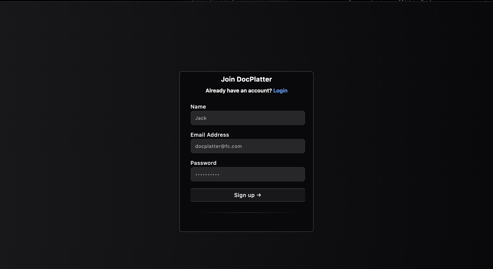

# E-commerce Chatbot

A simple chatbot web application where users can search for products by sending queries.  
Built with React on the frontend and Express + Prisma on the backend.

---

## Screenshots

---
 

 
---
## Features

- Search products by name, description, category, or tags  
- React chat interface with Axios for HTTP requests  
- Express.js REST API backend  
- Prisma ORM for database querying  
- CORS configured to allow frontend-backend communication  

---

## Tech Stack

- **Frontend:** React, Neon, Tailwind CSS  
- **Backend:** Node.js, Express, Prisma  
- **Database:** PostgreSQL (or compatible with Prisma)  

---

## Getting Started

### Installation

1. Clone the repo  
   ```bash
   git clone https://github.com/JatinMehta007/uplyft
   cd uplyft